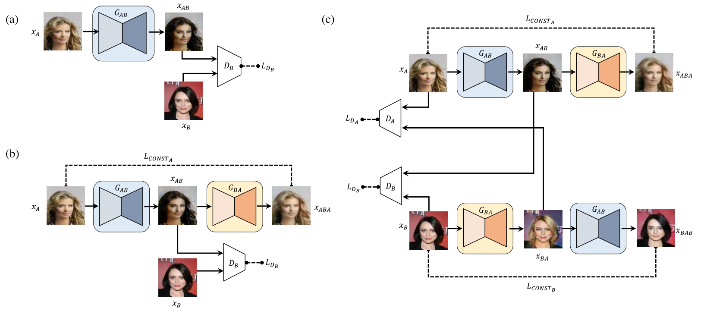
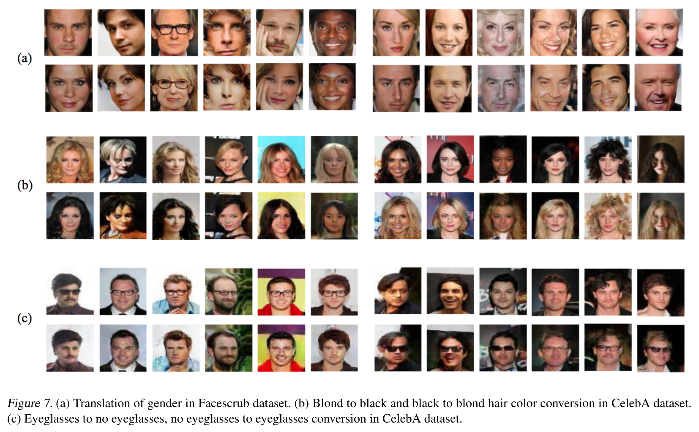

# DiscoGAN-Paddle

## 简介

Re-implement DiscoGAN in Paddle

基于 pytorch 源码：https://github.com/SKTBrain/DiscoGAN



DiscoGAN 通过 GAN 来学习不同域的特征，捕捉不同域之间的关系，利用这些关系，可以生成将风格从一个域转移到另一个域的图片，同时保留了关键属性，如方向和面部识别特征。

论文链接：[Learning to Discover Cross-Domain Relations with Generative Adversarial Networks.](https://arxiv.org/pdf/1703.05192.pdf)

## 环境依赖

- python 3.7
- paddle 2.1

## 数据集

CelebA 数据集：[celeba_aligned_for_cropped](https://aistudio.baidu.com/aistudio/datasetdetail/107578)

## 快速开始

预训练模型、训练日志、测试集demo，可到网盘自取：链接：https://pan.baidu.com/s/1hB34lEKMdh4YIh84kQOILQ 
提取码：sbsi

### Train

对于 gender conversion，训练 50000 个 iters 即可达到最佳效果。

#### 数据预处理（可选）

将 celeba 数据集 croped 到 128×128：

```
python DiscoGAN-Paddle/crop_celeba.py celeba_cropped path/to/img_align_celeba/ -o path/to/croped_celeba
```

下面的运行训练和预测代码以性别转换生成为例，

- **单卡：**
    
    ```
    python DiscoGAN-Paddle/discogan/image_translation.py \
        --image_dir path/to/img_align_celeba \
        --attr_file path/to/list_attr_celeba.txt \
        --task_name celebA \
        --style_A Male \
        --n_test 200 \
        --batch_size 200 \
        --epoch_size 1000 \
        --result_path ./results \
        --model_path ./models \
        --log_out ./logs \
        --ckpt_path path/to/discoGAN.pdparams \
        --local_rank -1 \
        --num_workers 4 \
        --learning_rate 0.0002
    ```
    
- **单机 4 卡：**

    AI Studio 脚本训练：`train.sh`
    
    ```shell script
    #!/bin/bash
    
    CELEBA=/root/paddlejob/workspace/train_data/datasets/data107578/img_align_celeba.zip
    ATTR_TXT=/root/paddlejob/workspace/train_data/datasets/data107578/list_attr_celeba.txt
    
    TO_DIR=/root/paddlejob/workspace/train_data/datasets/
    IMG_CELEBA=/root/paddlejob/workspace/train_data/datasets/img_align_celeba
    CKPT=/root/paddlejob/workspace/train_data/datasets/data107578/discoGAN5.9999.pdparams
    
    unzip -d $TO_DIR $CELEBA
    
    LOGDIR=/root/paddlejob/workspace/log/train_log
    OUTDIR=/root/paddlejob/workspace/output/model_imgs
    
    python -m paddle.distributed.launch --gpus '0,1,2,3' DiscoGAN-Paddle/discogan/image_translation.py \
        --image_dir $IMG_CELEBA \
        --attr_file $ATTR_TXT \
        --task_name celebA \
        --style_A Male \
        --n_test 200 \
        --batch_size 200 \
        --epoch_size 1000 \
        --result_path $OUTDIR \
        --model_path $OUTDIR \
        --log_out $LOGDIR \
        --local_rank 0 \
        --num_workers 4 \
        --learning_rate 0.0006 \
        --ckpt_path $CKPT \
        --iters 60000  # 预训练模型已经训练的迭代数
    ```

### Test

*现在训练了 gender 转换的模型*

- 设定数据集路径，加载预训练模型，设定输出路径:

```
python DiscoGAN-Paddle/discogan/evaluation.py \
  --image_dir path/to/img_align_celeba \
  --attr_file path/to/list_attr_celeba_demo.txt \
  --n_test 10 \
  --task_name celebA \
  --style_A Male \
  --batch_size 1 \
  --ckpt_path path/to/discoGAN.pdparams
  --result_path ./results
```

样例如下：

|A|AB|ABA|
| --- | --- | ---|
||||
||||
||||
||||

> 详见 `./assets/figs`。
> 
> 对于 CelebA 数据集，更多可以训练的跨域风格转换生成如论文中图 7 所示，训练方式见 `script.sh`。
> > 


## 模型信息

| 信息 | 说明 |
| --- | --- |
| 发布者 | [刘辰](https://github.com/ttjygbtj)、[吴海涛](https://github.com/Dylan-get)、[石华榜](https://github.com/S-HuaBomb)、[杨瑞智](https://github.com/buriedms)、[许观](https://github.com/HeySUPERMELON) |
| 时间 | 2021.11 |
| 框架版本 | paddlepaddle==2.1.2 |
| 应用场景 | GAN 图像风格转换 |
| 支持硬件 | GPU × 4 |
| 预训练模型下载 | 链接：https://pan.baidu.com/s/1hB34lEKMdh4YIh84kQOILQ 提取码：sbsi |
| AI Studio 地址 | [DiscoGAN-Paddle](https://aistudio.baidu.com/aistudio/projectdetail/2548914?contributionType=1) |
